# Procesverslag
**Auteur:** Neslihan Iliz

Markdown cheat cheet: [Hulp bij het schrijven van Markdown](https://github.com/adam-p/markdown-here/wiki/Markdown-Cheatsheet). Nb. de standaardstructuur en de spartaanse opmaak zijn helemaal prima. Het gaat om de inhoud van je procesverslag. Besteedt de tijd voor pracht en praal aan je website.

## Bronnenlijst
1. -bron 1-
2. -bron 2-
3. -...-

## Eindgesprek (week 7/8)

-dit ging goed & dit was lastig-

**Screenshot(s):**

-screenshot(s) van je eindresultaat-

## Voortgang 3 (week 6)

Vragen: 1. Hoe krijg ik de tekst onder mijn logo?
        2. Hoe haal ik de padding-inline-start: 40 weg?

Voortgang:

Ik heb me website css opnieuw gemaakt omdat ik het niet handig vond om met flexbox te werken de afbeeldingen waren soms lastig om op de goeie plek te laten staan. Ik heb nu gebruik gemaakt van grid en nu ziet mijn website er veel beter uit.

Verder heb ik besloten om geen javascript slide te maken omdat dat nog wel een te grote uitdaging is voor mij. Ik ga de slider alleen met css maken. Voor een js functie ben ik van plan om een darkmode knop te maken omdat ik wel weet hoe dat moet door programmeren. Ik ga de button ook leuk met css opmaken hoe Joost het bij les (weet niet meer welke) had uitgelegd.
 

## Voortgang 2 (week 5)

Navigatie is me gelukt om responsive te maken
De afbeeldingen heb ik ook responsive gemaakt
Media query heb ik goed kunnen toepassen

Slider met javascript heb ik nog moeite mee
Header website begrijp ik niet helemaal moet ik hiervoor grid gebruiken?

**Screenshot(s):**

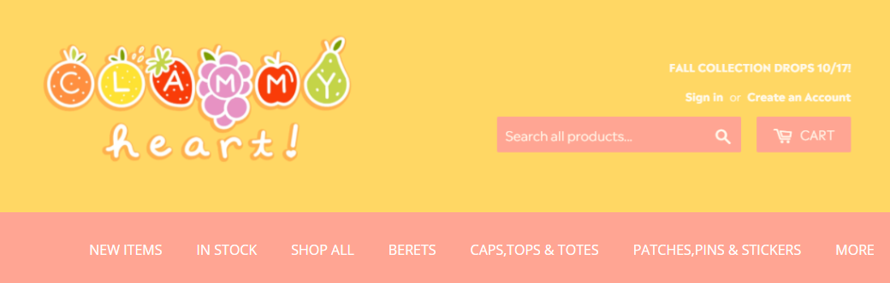

Slider voorbeeld
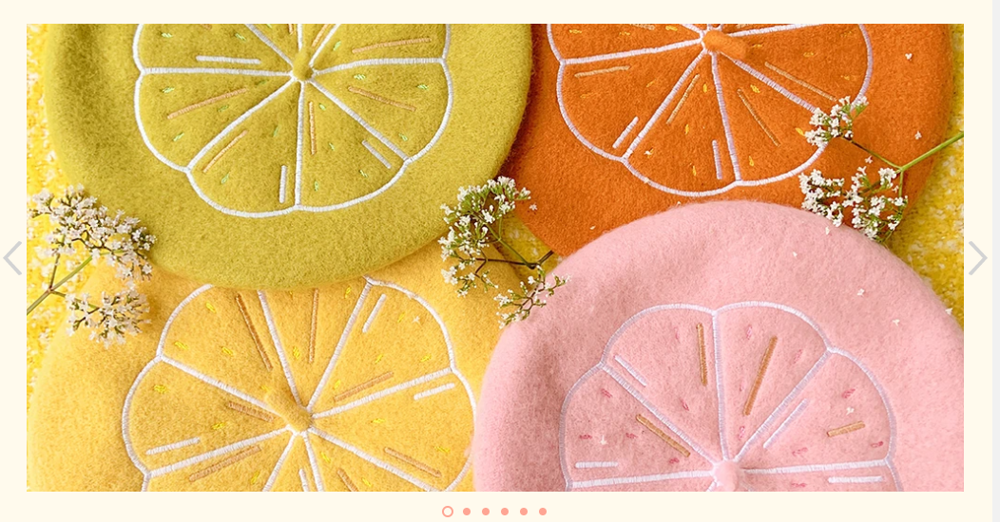

### Agenda voor meeting

1. javascript slider & header grid vraag (nesli)
2. vraag over de propertie; position fixed & automatische transities van afbeeldingen (stijn)
4. vraag over media query & object-fit voor afbeeldingen snap ik niet (Tom)

### verslag van meeting

1. voor javascript is wel lastig dus om extra hulp vragen bij de studentassistent.
2. header wel coderen en geen screenshot gebruiken.

## Voortgang 1 (week 3)

### Stand van zaken

lastig om de navigatie responsive te maken ik heb geprobeerd om de hamburger menu te maken maar is me uiteindelijk niet gelukt.

Foto's met flexbox positioneren is me wel gelukt.

Footer en header moet ik nog toevoegen en ook nog een e-mail form.

**Screenshot(s):**

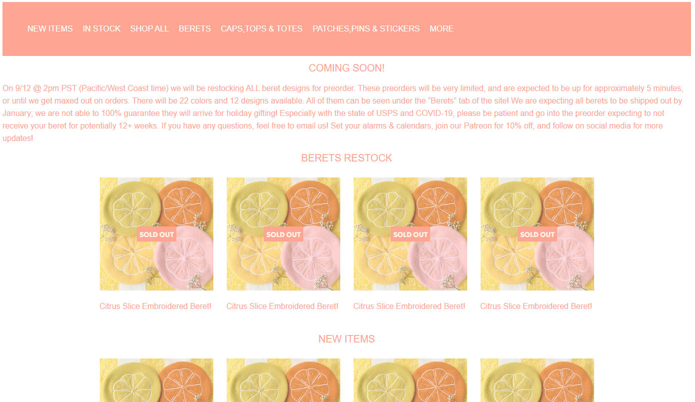
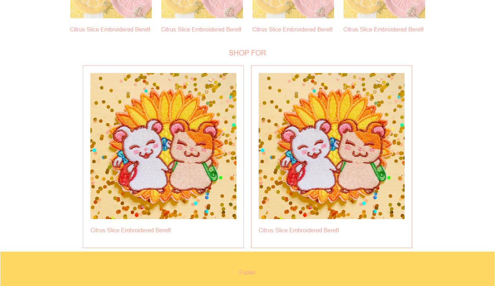

### Agenda voor meeting

1. vragen over hamburger menu
2. 

### Verslag van meeting

Tip: begin bij de stukjes dat je makkelijk vind en doe de moeilijkere stukjes pas later.

## Intake (week 1)

**Je startniveau:** BLAUW

**Je focus:** responsive

**Je opdracht:** https://clammyheart.shop/

**Screenshot(s):**

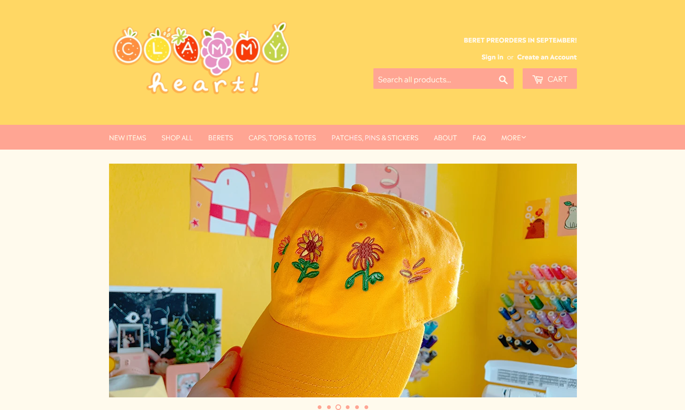
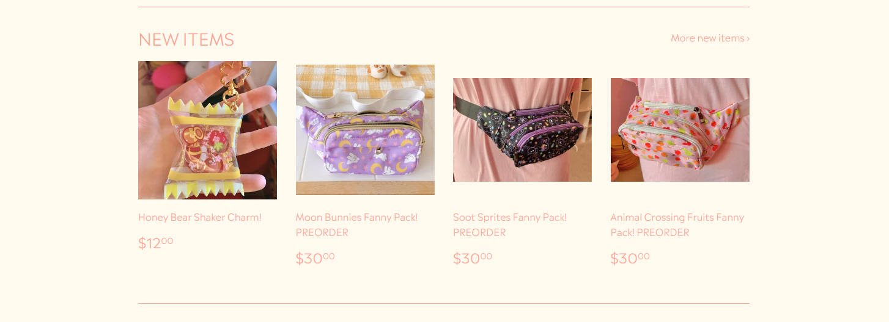
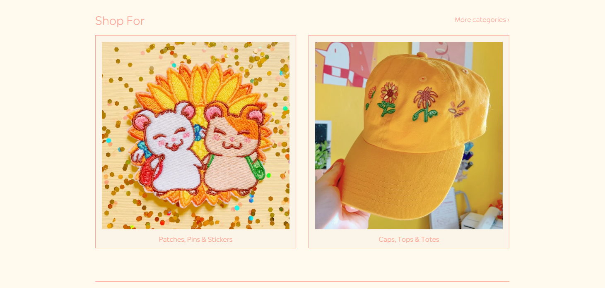
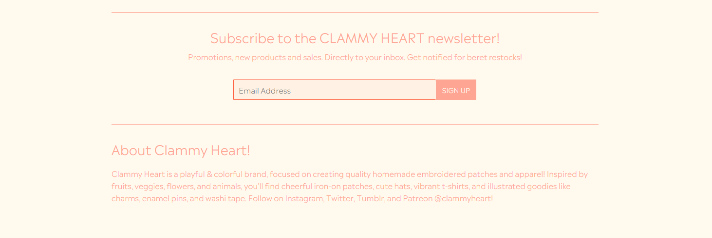
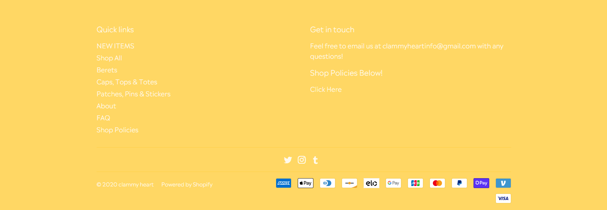

**Breakdown-schets(en):**
Breakdown schets
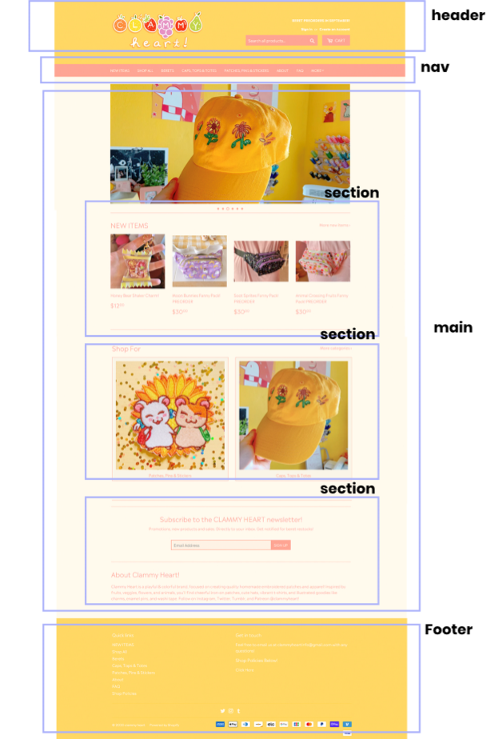
Styleguide
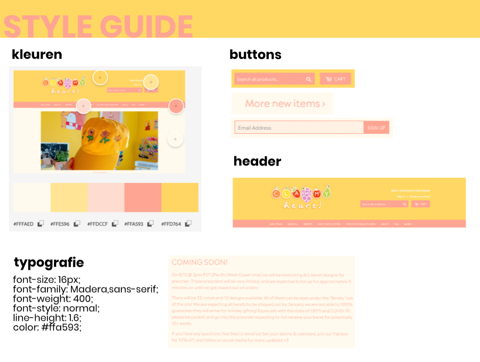